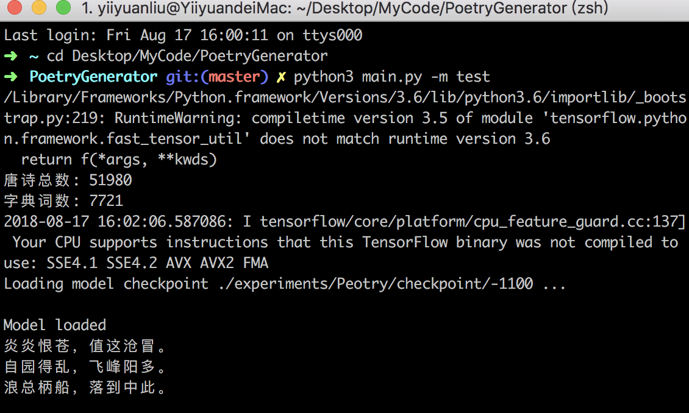
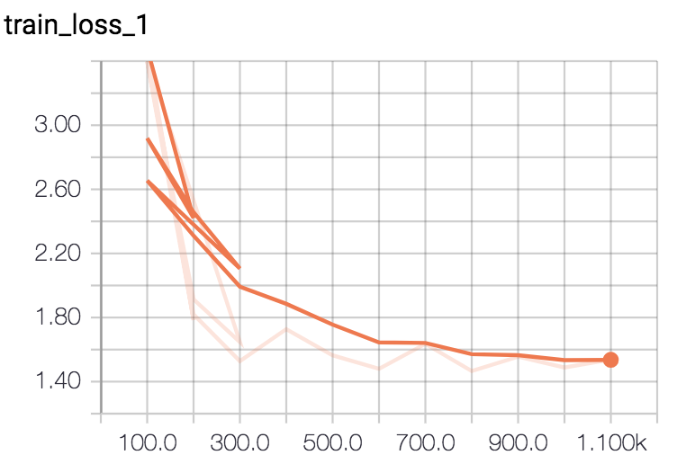

# Peotry

A Chinese peotry generator using LSTM and GRU model.

### Usage

* train: 
	* LSTM `python3 main.py -m train -c lstm`
	* GRU  `python3 main.py -m train -c gru`
* generate peotry:
	* LSTM `python3 main.py -m test -c lstm`
	* GRU `python3 main.py -m test -c gru`

### Results

After 10 epochs

Loss:

